# Chronica

**A living ASCII world that writes its own history.**

Chronica is an emergent civilization simulator that runs entirely in your browser as a single HTML file. No build step, no dependencies, no server. A procedurally generated continent is settled by clans of simulated people who farm, marry, raise children, trade, pray, rebel, and march to war. Kingdoms rise, dynasties fall, religions spread along trade roads, and every event is written into a searchable chronicle. You can leave it running at 100x speed, come back hundreds of simulated years later, and ask the world one question: what happened here?

**Play it now: [https://eeman1113.github.io/chronica/](https://eeman1113.github.io/chronica/)**

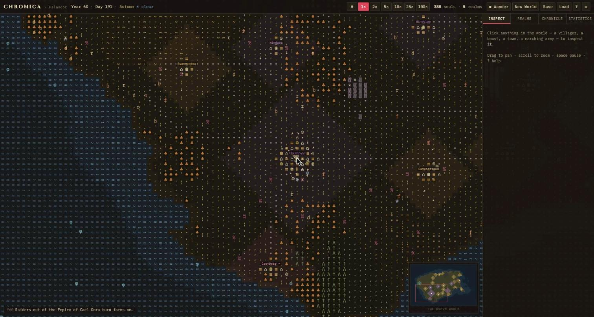

---

## The core idea

> Create a world that continues to exist even if the player does absolutely nothing.

There is no scripted story and no win condition. Every villager on the map is a real simulated person with a name, a family tree, a profession, personality traits, and a biography that fills in as their life unfolds. Stories are not authored, they emerge from the systems colliding.

A real example from a test run, produced with zero scripting: a man named Torgard Wilgard came of age in Year 21, married twice, slew four bears as a hunter, took up arms as a soldier of Fordwick, and was crowned Emperor of the Empire of Cael Dora in Year 56 after the previous emperor starved to death in a famine. Every step of that life is inspectable in the UI.

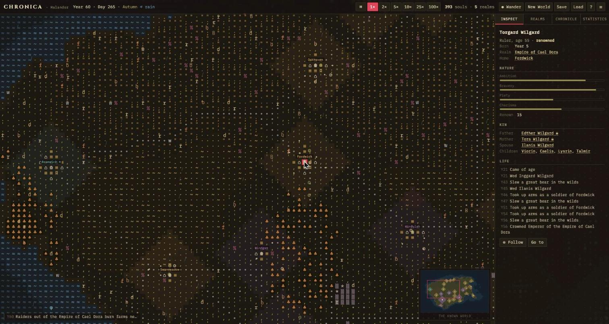

---

## What is simulated

### The world
- Seeded procedural generation: the same seed always produces the same world
- Fractal noise elevation with a distorted continental mask, so every world is one large landmass with islands and a ragged coast
- Rivers that begin in wet highlands, flow downhill, merge into each other, and carve small lakes where they get stuck
- 14 biomes assigned from elevation, latitude temperature, and moisture: ocean, deep ocean, shore, grassland, heath, forest, taiga, desert, tundra, snowfield, mountains, high peaks, marsh, and lakes
- Scattered resources: berry thickets, ore veins, and rich fisheries
- Physical deforestation: every tree a woodcutter fells is really removed from the map, leaving stump fields that ring old towns, and the forest slowly grows back in from its standing edges over decades
- Four seasons that recolor the entire map, weather fronts (rain, storms, snowfall, overcast skies), and drought years that wither crops
- Wildlife with its own ecology: deer, hares, boar, foxes, wolves, bears, cows, pigs, horses, lions, tigers, crocodiles, salmon, and fish shoals that graze, hunt each other, reproduce toward a population cap, and get hunted by people
- Salmon live full emergent lives: a heritable urge pulls the mature fish upstream as the water cools, they spawn in the gravel of whichever headwater their own river offers, and the run costs them everything; the spent fish drift, die, and feed the banks and the bears
- Crocodiles are patient ambush minds at the water's edge: hunger that grows slowly for weeks, basking when cold, torpor in hard winters, territory yielded to bigger rivals, carrion stolen from the shore, and everything that comes down to drink is prey, sometimes including people; a crocodile with a body count earns a name and becomes a legend
- Nobody teleports home and nobody is silently rehoused: each family holds one house with room for six, a monthly allotment assigns roofs with the wealthiest keeping theirs, families that do not fit are homeless and sleep in the lanes where fevers find them first, and a homeless family with coin enough will pay to raise its own house

### The people
Every person has:
- A culture-flavored name and an inherited family surname
- Parents, spouse, and children, all clickable links in the inspector
- An age, a birth year, and a daily mortality curve that bends sharply upward in old age
- Four personality traits (ambition, bravery, piety, charisma) that feed directly into politics
- A profession: child, farmer, hunter, fisher, woodcutter, miner, trader, soldier, priest, laborer, elder, or ruler
- A renown score and a personal biography of life events
- A daily routine: people physically walk to forests, mountains, rivers, and fields to work, then walk home

Marriages are matched quarterly inside each settlement. Births require a food surplus. Children come of age at 16 and are assigned work based on what their settlement needs. A hunter who survives a bear attack earns renown, and renown is the currency of succession.

### Settlements and economy
- Settlements are founded on scored sites: fertile land, fresh water, timber, and distance from rivals all matter
- They physically build over time: houses, fields, markets, temples, keeps, and walls appear on the map as population and stockpiles grow
- A daily economy tracks food, wood, stone, and wealth per settlement, with seasonal farm yields, hunting and fishing income, and winter deficits eaten out of storage
- Overcrowded or starving settlements send out migrant parties that walk across the map and found new towns
- Settlements that lose everyone fall silent and are reclaimed by the wilderness
- Market towns send trade caravans to their neighbors, which improve relations, carry wealth, spread religions, and occasionally carry plague

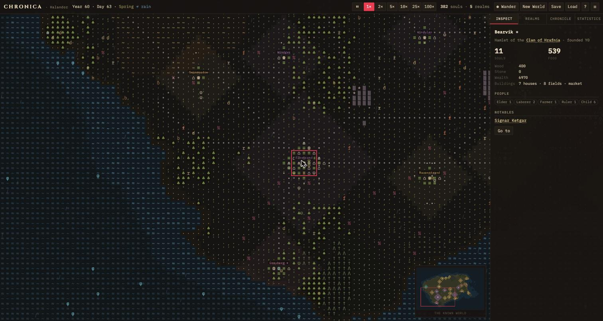

### Physical growth and a physical land
The map is not a backdrop, it is state that the simulation reads and writes:

- **Towns physically sprawl.** Settlements claim new ground as their population grows, staying connected to the town body, skirting water and peaks. A hamlet is a tight cluster, a city is a sprawl with houses that prefer roadsides and fields that belt the outskirts in contiguous farmland
- **Fields follow the farming year.** Farm tiles are plowed lines in spring, swaying green in summer, gold at harvest, and stubble under winter, so farmland reads instantly at any zoom
- **Lakes recede under heavy use.** A thirsty town drains its lake edge into mudflats, faster during droughts and where canals feed fields. Kind years refill the shoreline. A city really can kill its lake
- **Canals.** Realms that master Irrigation dig visible canals from rivers and lakes to dry towns, boosting their fields. When a town dies its canals silt up and vanish over the years
- **Wildfires.** Dry summers, drought years, and lightning storms ignite forests. Fire spreads tile to tile, blocked by rivers and roads, doused by rain, and it will burn through a town in its path, destroying buildings and killing people. Burn scars blacken the map and regrow over decades
- **Ruins persist.** Razed and abandoned settlements leave crumbling ruin tiles that decay back into the land across generations, so the map carries its own archaeology

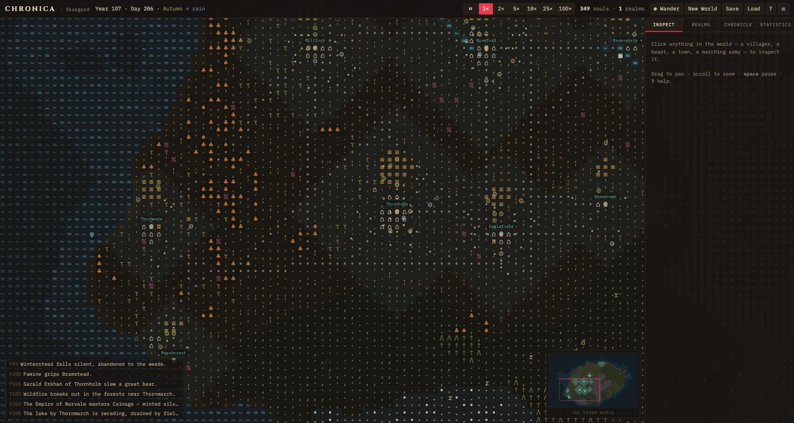

### Worm minds: a real nervous system for every beast
An optional world mode, chosen in the New World dialog and woven permanently into that world, replaces animal instinct scripts with something audacious: every land animal runs its own live copy of the complete C. elegans connectome, the famous fully mapped nervous system of the roundworm (Cook et al. 2019, obtained through the OpenWorm project). This is not a metaphor. The file embeds the real wiring: 300 neurons and 5,806 chemical and electrical connections, simulated as a spiking leaky integrate-and-fire network with inhibitory GABAergic cells signed from the literature.

- **Senses in.** A nearby predator stimulates the worm's actual nociceptors and touch neurons (ASH, FLP, ALM, AVM). Food and hunger drive its real chemosensory and internal-state cells (AWA, AWC, ASE, ASI)
- **Spikes through.** Activity propagates through the genuine synaptic wiring, kept sparse by global inhibition, with each animal carrying its own private neural state
- **Movement out.** Locomotion is read from the worm's real command circuits: AVB and PVC firing drives forward motion, and when the AVA, AVD, AVE escape circuit out-fires it, the animal bolts away from the stimulus. In testing, a wolf placed three tiles from a deer triggered exactly this cascade and the deer fled in reversal bursts while the hungry wolf's own brain drove the pursuit
- **Ecology follows.** Worm-brained predators only hunt when hungry and cannot breed while starving, because their first version hunted every herbivore on the continent to extinction in 24 years, which was impressive and had to be nerfed
- **Watch it think.** Select any animal and the inspector shows its nervous system live: a raster of all 300 neurons flashing as they fire (amber sensory, mauve interneurons, blue motor) with forward and escape drive bars computed from the real command pools
- **Read its mind.** Above the raster sits a Mind panel, every line derived from the network rather than scripted: what the animal is doing (fleeing the wolf, stalking prey, grazing, roaming, resting), what it senses and how far away, its current urge phrased from whichever command circuit dominates, and affect bars for fear, hunger, and arousal read off threat drive, internal state, and firing rate. Watch fear spike during a chase and slowly decay after the escape

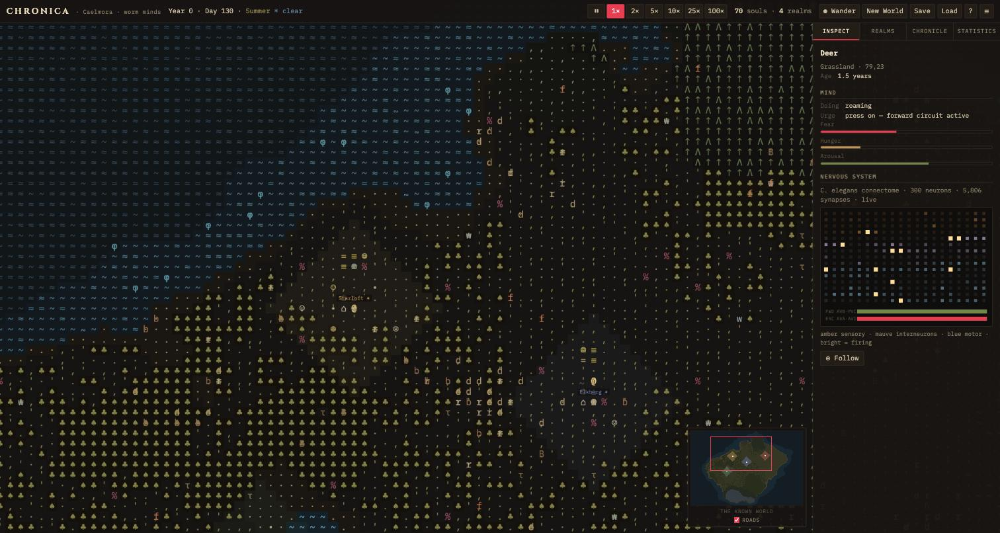

- **See the actual brain.** Above the raster sits a translucent top-down anatomical view of the worm's nervous system built from the real soma coordinates in OpenWorm's NeuroML files: the nerve ring blazes as a dense cluster in the head, the ventral cord motor neurons run in a chain down the body, the strongest synaptic tracts are traced as faint colored threads, and every neuron flashes in its true anatomical position when it fires

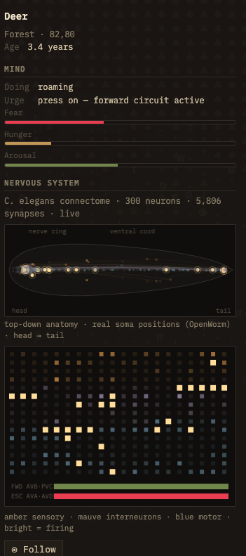

The default remains classic instincts. Brains are budgeted so 100x speed still works, and the mode adds about 46KB of connectome data to the file.

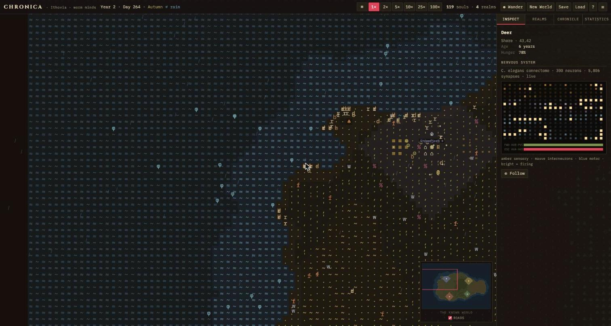

### The sea is crewed
Every hull that leaves a harbor sails with named souls aboard. Fishing boats take a fisher and a hand from the town; trade cogs take a trader to strike the bargain and a sailor to work the sheets; settler ships carry whole families and war fleets carry the host. Click any ship and her panel opens: kind, whose colors she flies, her port, her heading, her cargo, her mission in plain words, and everyone aboard by name and role, each a clickable life. Trade cogs sell their cargo at the far quay and sail home along their own wake; a crew with no way home settles where the sea left them. And the sea takes its toll: any hull can founder in a storm, coast huggers least of all, and when a ship goes down her crew drowns with her, every death recorded and the loss written into the chronicle with its cause.

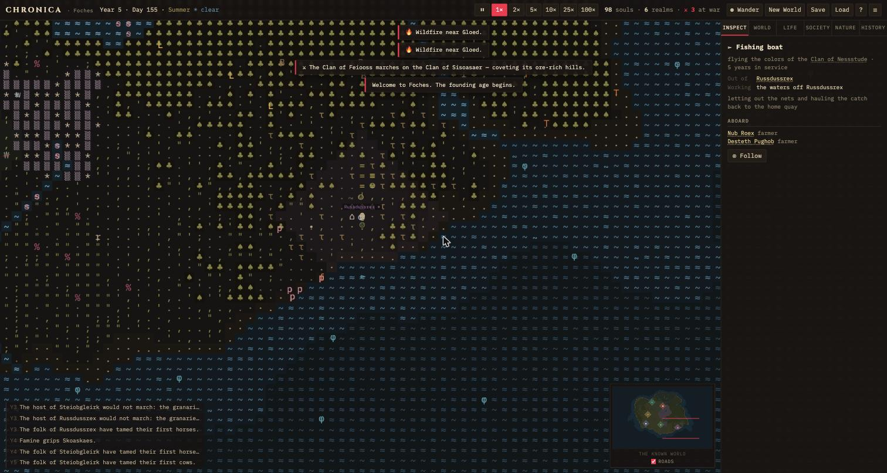

### The sea
Coastal towns put to sea: fishing boats work the water and feed their harbor, trade ships run routes between ports carrying wealth, faith, and sometimes plague, settler ships colonize empty islands, and armies that cannot march to an enemy take ship and land on hostile shores. Island maps fight completely different wars.

### A history that explains itself
- **Eras.** The chroniclers name the periods of history by what actually filled them: The Long Peace, The Burning Years, The Age of Spears. The Chronicle opens with the chaptered list
- **The timelapse.** Every year the political map is snapshotted. One button in the Chronicle replays the centuries as an animated map with a scrubber: borders breathe, empires swell and shatter
- **Books.** Realms that master Writing produce readable volumes, sagas and annals composed from their real recorded history, listed in each realm's library
- **Relics.** Master smiths forge named blades, prophets leave idols, slain beasts leave skulls. Each relic keeps a provenance: inherited on deaths, looted in sacks, laid to rest in temples, every step clickable
- **Grudges.** Survivors of conquest and razing remember who did it, and their hatred feeds the rebellion odds of the towns they settle in
- **Family trees.** Every person's panel opens a clickable dynasty tree of their whole house, living and dead
- **The great beast.** Rarely, a named terror awakens (Drakmaul Old Hunger, Thulrend the Shadow) and preys on the land for decades until a hunter of sufficient renown ends it and claims its skull

### Neural evolution
In worm-mind worlds, newborn animals inherit their parent's circuit gains with small mutations: threat sensitivity, food sensitivity, escape-command gain, forward-command gain. Predation selects on those real connectome parameters, and the Statistics tab charts the drift across generations. There is also a lesion tool: click any neuron in the anatomical view to silence it and watch the behavior change.

### Instinct minds: every animal weighs its life
In every mode, not just worm worlds, animals now run a utility mind. Each creature carries real needs that accumulate (hunger, thirst, fatigue) and real senses (predators, prey, water, herd-mates, pasture), weighs its goals each day (flee, drink, eat, rest, rejoin the herd, roam), and acts on the winner. The inspector shows the whole inner life: current action, what it senses, the actual utility ranking as a chain of thought, and need bars. Rain fills the puddles; drought makes thirst a killer; starvation and dehydration are real deaths, which makes the four heritable instinct genes (wariness, appetite, boldness, herd instinct) matter: they mutate at every birth in every mode, and selection is charted in Statistics. Towns also now remember why they exist: founded fleeing a famine, easing a crowding, or carried across the sea, stated in the settlement panel.

### Pro mode: zero scheduled drama
The New World dialog offers two simulation tiers. Normal is the classic engine, where some history is paced by tuned probabilities so every world stays lively. **Pro** removes every dice roll that decides whether history happens:

- **Rebellions are plotted, not rolled.** People form real friendships where their lives overlap. An ambitious person whose measured grievance (grudges, kin lost, famine, foreign faith) is high enough begins a plot and recruits through their actual social graph, one friend at a time. The uprising fires only when the following outgrows the real garrison, and the chronicle reports how many souls answered and why
- **Wars have a casus belli.** Leaders declare war only when their realm measurably lacks something (ore, grain, land) or the ruler carries a personal grudge, the target actually has it, and the odds are not hopeless. The chronicle states the reason: "declares war upon the Chiefdom of Thulen, for its full granaries"
- **Legends are earned.** No beast is spawned. A bear that accumulates a real body count of prey and hunters earns a name and becomes the terror, its legend a biography
- **Prophets are born of grief.** Revelation strikes a specific pious person who just lost kin to plague or famine, never a world-rate roll
- **Relics need means.** A blade is forged only where a realm has the craft, the town has the treasury, and a patron of real renown pays for it
- **Minds break.** Loss and famine accumulate as stress against a person's resilience; breaking takes the shape of the person: some walk into the wilds, some turn violent, some turn bitter and feed future plots

The mode is chosen at world creation and woven in permanently. The speed ladder in pro adapts to your processor (detected from core count), so weaker machines cap at 10x or 25x and strong ones still reach 100x. Quality first.

### History as data: event cards and consequence chains
Every chronicle event is a record, not just a sentence: a unique id with optional actor, victim, location, cause, and an accumulating list of consequences. Events cause events. A war declaration collects its battles, sieges, town falls, and the final peace; a famine links to the exodus it forced and the town that exodus founded; a ruler's death links to the coronation it triggered; plagues name the caravan or ship that carried them; wildfires name the lightning or the drought; the great beast's awakening collects its predations and, in the end, its slayer. Click any chronicle entry to open its card, and walk the chain in either direction, because every cause and every consequence is itself a clickable card.

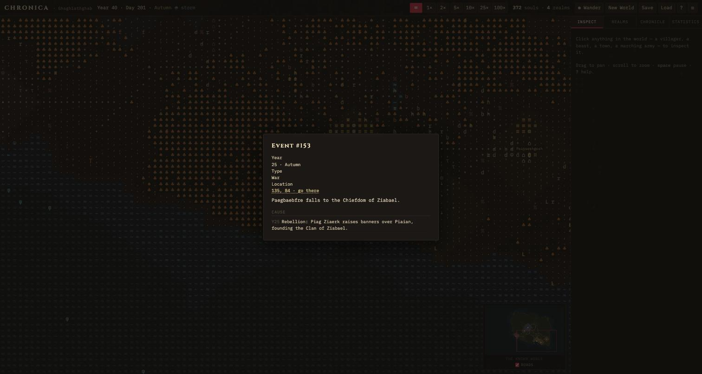

### Beasts of burden and beasts of prey
The fauna grew into a food web. Cows, pigs, and horses roam wild with designed temperaments expressed as heritable gene priors (docile herd-bound cows, greedy fast-farrowing pigs, flighty horses with three-tile flight bursts), and lions and tigers stalk the hot grasslands and deep forests as apex predators, as dangerous to hunters as bears and just as capable of becoming named legends through real man-kills.

- **Domestication is proximity, not dice.** Herds that graze beside a town's fields are folded in; the first taming is a chronicle event with its true cause. Livestock keeps its full mind plus a pull toward home, feeds the town daily, goes feral if the town dies, and a town with horses fields mounted armies and caravans at double pace
- **Grazing really eats the grass.** Grazed tiles turn bare on the map and regrow at the land's own moisture rate, so dry country recovers slowly and overgrazed herds must migrate
- **Everything fears fire.** Smoke within scent range outranks every other threat and triggers stampedes
- **Carnivores compete.** Rivals contest hunting grounds and the loser is driven off or killed; a starving carnivore will turn on lesser carnivores
- **Herds shield their young.** An adult with strong herd instinct can block a kill on a juvenile, and sometimes dies doing it, which puts herd loyalty itself under selection

The long-run payoff is real evolution you can read: after 48 generations beside a town, one test cow's lineage panel showed wariness down 39 percent, boldness down 31 percent, and appetite up 31 percent. Nobody wrote the domestication syndrome; living safely next to humans selected for it.

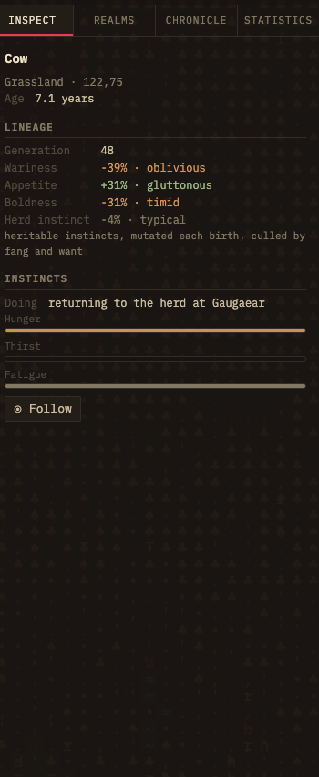

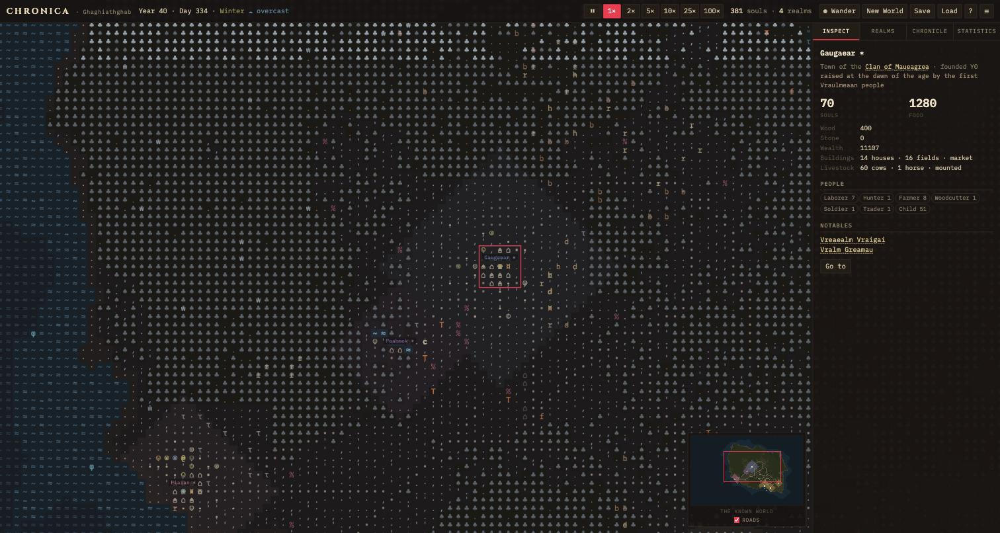

### Walls, and the rope that builds a herd
A wolf's hunger now reaches into towns as it always could in the old world, but the counterweights are physical, never scripted: a crowd is its own wall (every neighbor within sight makes the beast likelier to lose its nerve), the watch answers harder on home ground, and a town that has bled enough raises a real one. The wall is planned as a circuit around the town's actual grown shape, gates where the roads run, the water serving where it flows, and it rises stone by stone over months: each course spends two real stones from stores the miners filled, and when the stone runs out the wall stands half-built with the gap exactly where the wolves keep coming through. A finished circuit shuts out everything wild except what dares the gate, and gates have a real state: the herd noses them open passing through, and they stand open, drawn in amber on the map, until someone with free hands bars them by dusk. A town hollowed by famine or war has no free hands, and the chronicle will tell you exactly what that cost: the gate stood open in the night, and the wolf knew it. And taming now needs a lead: a rope twisted from a log and cut grass (a drought year cuts no rope), kept coiled in the storehouse, spent each time a wild horse or cow or pig is brought home to the pen. No rope, no herd.

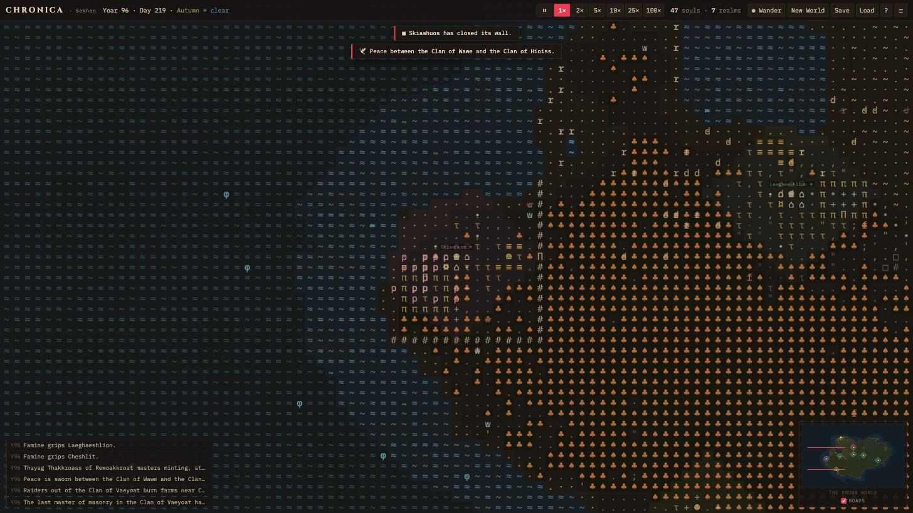

### The hunt goes both ways
A starving predator of a bold line, in woods the drought has emptied, will weigh a person on a lonely path; only in the wilds, never inside a town's ground, where noise and the watch rule. The attack is a contest: a brave hunter kills the wolf and is celebrated, a farmer may be dragged into the brush, and a neighbor can come running at the screams. Every man-kill feeds the body count that makes legends. Towns answer from their ledgers, never from dice: attacks are tallied per species, and enough of them declare a cull, hunters going out specifically against the offending kind for a season. An empty larder and a dear market price for meat send them instead after whatever herbivore actually grazes nearby, so the economy drives the hunting pressure. A cull with surplus meat stakes out bait, drawn as a β at the wood's edge: the bait is a real lump of granary meat that the existing carrion senses of every hungry nose can find, a hunter lies in wait beside it, and the trap resolves as bravery against tooth. Sometimes the quarry dies at the bait. Sometimes a fox steals the meat first. Sometimes the hunter is mauled at their own trap.

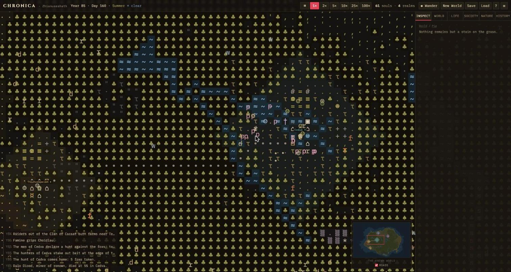

### The food web, tooth and claw
Predators do not roll dice against a spawn table; they hunt. A hungry bear picks up a real scent, and its inspector shows the whole decision: what it senses, what it weighs, and why hunting won. The bear below is generation 83 of an unbroken lineage, its gluttonous appetite (+45 percent) and solitary habit (-43 percent) the product of eighty three rounds of birth, mutation, and death.

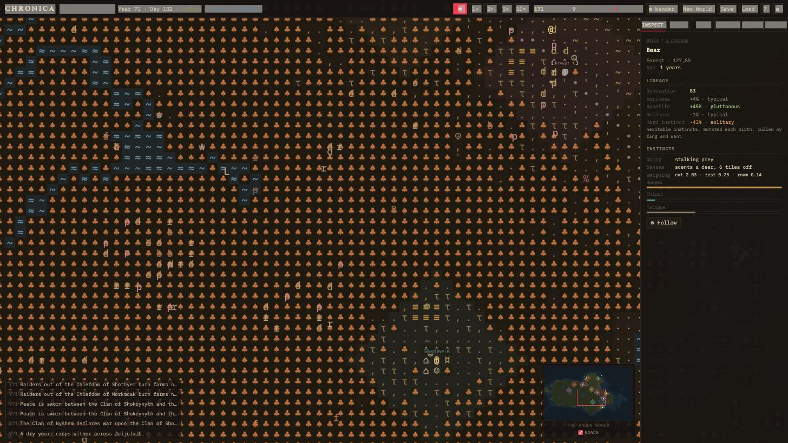

Death is not deletion. A kill or a starvation leaves a carcass on the map, drawn as a struck-through letter, that rots at the pace of the season: summer ripens it, winter preserves it. Click one and the inspector reads its state like a field necropsy: cause and date of death, decay stage in warm-days, meat remaining, and who could still safely eat it. Scavengers strip carcasses in the order of their stomachs, foxes and pigs first, proud cats last and only when starving, and what rots in place feeds the soil beneath it. Below, a boar has already eaten six of the ten meat off a deer that starved three days earlier.

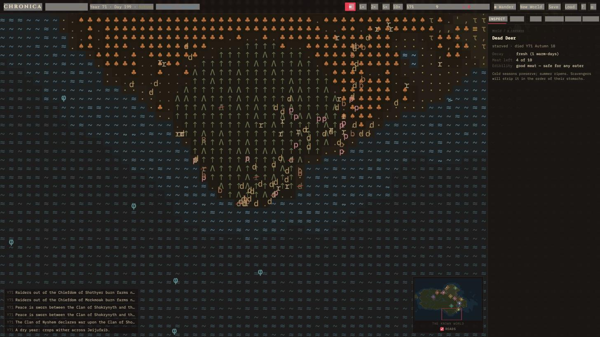

### The river and the water's edge
Salmon live whole emergent lives. A heritable urge builds in each mature fish as the water cools, and when it wins the weighing they run upstream, dodging bears in the shallows, to spawn in the gravel of whichever headwater their own river offers. The run costs everything: the spent fish drift, die, and feed the banks. Selection is visible in the panel, because only fish that reach the gravel leave descendants: the runner below is generation 33 and carries an upstream drive 94 percent above its founder stock.

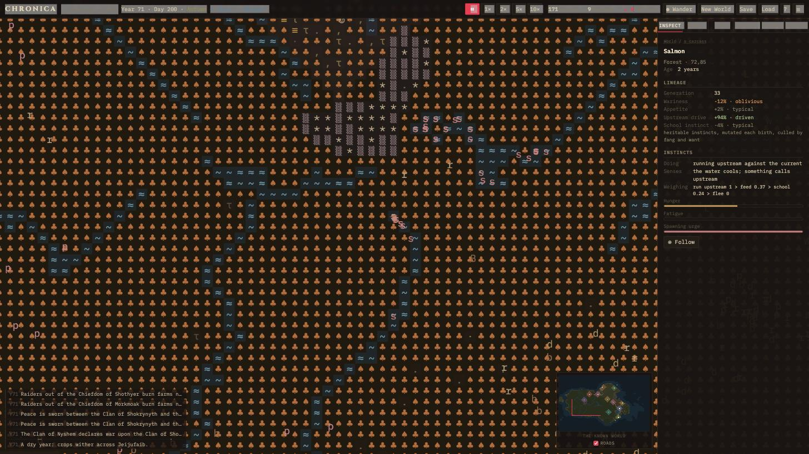

Crocodiles are patience made flesh. Their hunger builds over weeks, not days, and their whole strategy is the water's edge, where everything must eventually come to drink. They bask when cold, go torpid through hard winters, yield territory to bigger elders, steal carrion off the shore, snap salmon from the current, and take drinkers at the bank, sometimes people. A crocodile that builds a body count earns a name and becomes a legend the same way a man-eating bear does. The one below has waited so long its ambush weighing reads 1.44 and its hunger bar is full.

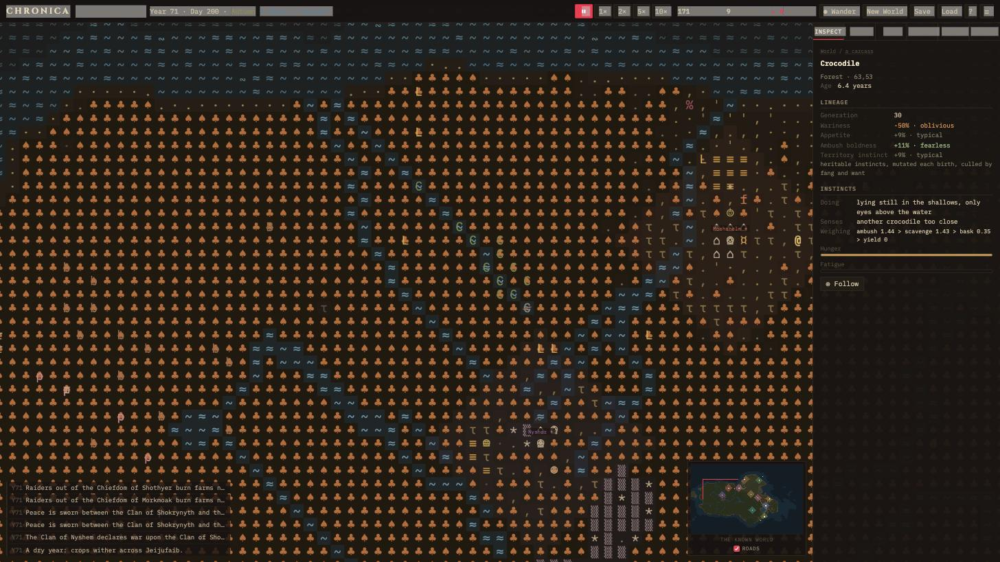

### A language for every world
No name in Chronica comes from a fixed list. Each world seed grows its own phonologies, sound inventories and syllable habits, for its five cultures, its geography, and its monsters. People, surnames, towns, realms, deities, relics, and named beasts are all words in languages that exist only in that one world, so no two runs ever share a name. Surnames still inherit through families, settlement names still take culture-specific suffixes, and religions are named for generated deities in their founder's tongue.

### Quality of life
The world autosaves to the browser every three minutes (recoverable from the Load dialog), and the whole simulation still runs from one HTML file.

### Ambient animation
The world moves at rest: water shimmers with a slow glyph cycle, growing fields sway, wildfires flicker with rising smoke, and chimney smoke drifts over inhabited houses when you zoom in close. All of it is subtle, throttled for performance, and disabled automatically for users who prefer reduced motion.

### Timber on real backs, fences bought with losses, graves kept by memory
Wood is a physical pipeline end to end. A woodcutter walks to a standing tree, fells it (the tile really loses its tree), shoulders the logs, and carries them home to stack. Open-air stacks hold only so much; a town whose stacks keep brimming raises a storehouse, and every house, market, and fence is built by drawing those same logs down. Full stacks mean the cutters rest; a burned storehouse is a winter's timber gone.

Fences are bought with counted losses, never scripted. Every head of livestock a predator takes is tallied by the owning town, and only a town that has bled enough animals, and has the logs stacked, rings its pasture with a timber pen, gate and all. Penned herds keep to the pen and manure its soil. Fences rot without yearly logs for upkeep, and a starving, bold wolf can clear a rotting fence in one leap; the raid is the same hungry decision it always was, the pen just concentrated the prey. When the herds are struck, the town's bravest hunter or soldier answers, and the one who kills the wolf at the pens earns renown, the same renown that crowns kings.

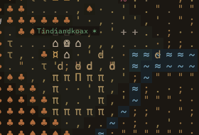

Every death in a living town becomes a real grave on real graveyard ground at the town's edge (the drowned get none; the sea keeps them). A grave endures while someone living actually remembers the person, read from the real kinship, bond, and memory systems. When the last rememberer dies the stone weathers, and in time the grass takes it. The renowned get monuments that outlast memory. Click any grave tile: the monuments, the stones still read, the ones weathering, and the count worn beyond any name.

### Physical extraction
Resource gathering acts on the map itself, not just on numbers:

- **Woodcutters fell real trees.** Each completed logging trip converts a forest tile into cleared land marked with stumps. Towns visibly eat into their forests over the years, leaving brown clear-cut rings you can see from the continental view. Cleared land regrows into forest from its standing edges at a slow yearly rate, so abandoned regions heal and busy ones stay scarred
- **Hunters stalk real animals.** A hunter checks for actual prey within range and walks to where the animal is standing. Every kill removes a specific creature from the ecosystem, and wildlife reproduces faster when depleted, so hunting pressure and rebound are in real tension
- **Scarcity feeds back into the economy.** Each settlement measures the forest and the game that actually remain around it every season. A town that has stripped its hinterland earns a fraction of the wood and hunted food it used to, which pushes it toward farming, trade, and sending settlers to fresh land

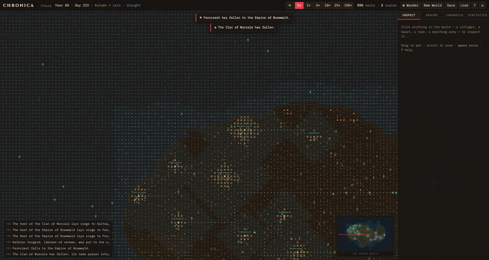

### Roads
There is no road-building algorithm. Caravans and armies increment a usage counter on every tile they cross, and when a tile has been walked enough times it becomes a road, drawn in grey. Where a well-used route crosses a river, a bridge appears. The road network you see on the map is the fossil record of decades of actual journeys.

### Politics and war
- Factions have leaders, capitals, cultures, dynasties, and a relations score with every other faction
- Border pressure, religious differences, ambitious rulers, and random raids sour relations year by year until someone declares war
- Wars are fought by real armies: soldiers are pulled from settlement populations, mustered into hosts led by the most renowned member, and marched across the map
- Armies meet in field battles, lay siege to towns, and either conquer them (the town changes color and allegiance) or burn them to the ground
- Casualties are real people: each fallen soldier is a named person who is removed from a family
- Wars end in negotiated peace as war weariness and battle scores accumulate
- When a ruler dies, succession weighs children of the old dynasty against the most renowned and ambitious people in the realm, which is how a commoner can found a new royal house
- Close successions can split the realm in a war of succession, and conquered towns simmer for a generation and can rise in rebellion

### Faith
Prophets appear rarely among the most pious, proclaim a procedurally named religion (The Order of the Silent Sky, The Song of the Flame, The Temple of the Sun), and convert their home town. Faiths then spread between neighboring settlements and along caravan routes, factions adopt the religion of their capital, and shared or opposing faiths feed back into diplomacy.

### Progress and calamity
- Realms accumulate research from their population and unlock advances in sequence: Bronzeworking, Masonry, The Wheel, Writing, Irrigation, Ironworking, and Coinage, each with a real mechanical effect
- Plague breaks out in large trading towns, kills daily, spreads through caravans, and burns out after claiming a counted toll
- Famines emerge naturally from the food model in bad winters, droughts, and sieges

### The chronicle
Every event above is recorded with its year and location: foundings, wars, battles, sieges, conquests, razings, coronations, rebellions, plagues, famines, prophets, discoveries, and the deaths of the renowned. The Chronicle panel is searchable, filterable by category, and clicking any entry jumps the camera to where it happened.

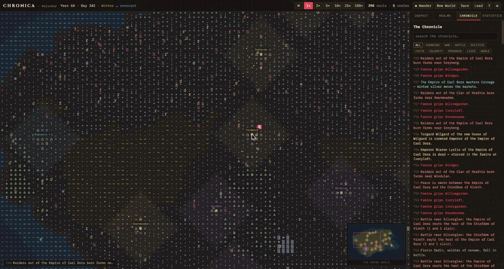

---

## The interface

### A living vegetation ecology
The map is not painted scenery. Every land tile is an ecological cell holding a real plant community: one of nine species (meadow and steppe grasses, bramble, oak, pine, swamp reed, desert scrub, river willow, and cultivated grain), its standing biomass, the litter of its dead, the water and nutrients of its soil, a seed bank that remembers what once grew there, and a locally selected drought tolerance. Growth is biology times environment: temperature by latitude, season, and altitude, soil moisture recharged by real rain and drawn down by sun and roots, nutrients returned by decomposition. Cold is dormancy, drought is stress, saturation drowns the wrong roots. Grazers eat actual biomass and dung the soil back; thin pasture means hungry herds and fewer calves. Fields are crop patches on the same engine, so harvests genuinely differ town by town with soil, weather, and blight, which spreads root to root through dense wet plantings. Fire burns actual fuel and its ash feeds the ground. Forests return only where seeds, soil, and rain agree, so an abandoned town is reclaimed by whatever its seed banks held, not by a script. Press V to see the world through ecological lenses: biomass, soil nutrients, soil moisture.

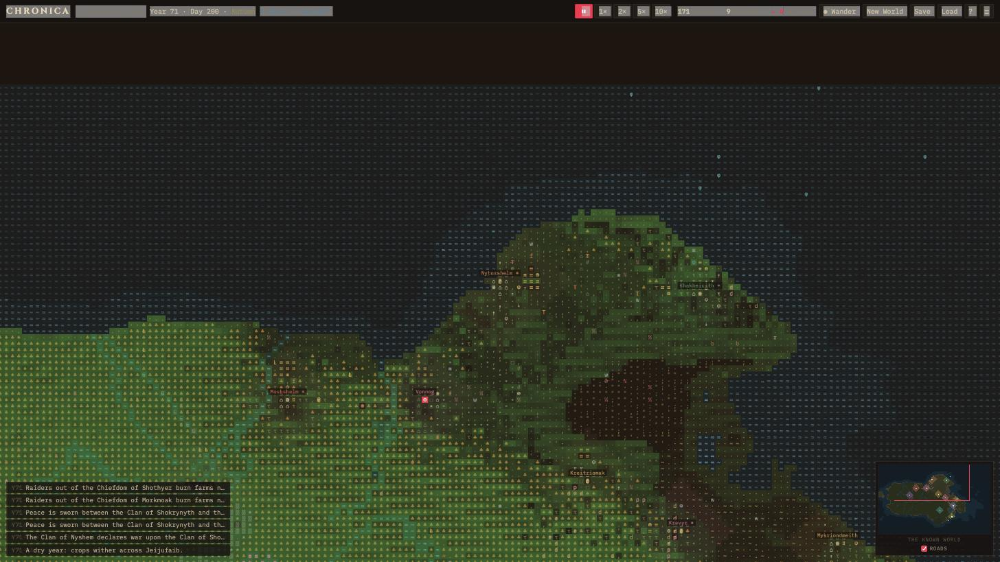

### The World Observatory
The right sidebar is not a dashboard, it is an observatory into the world. Chronica has no player, only an observer, and the observer can descend from the whole world to a single fish. Six views: Inspect, World, Life, Society, Nature, History. The World overview answers "what is this world right now" with population, realms, money systems, forest cover, active fires, births and deaths this year, and every number is clickable and drills down into its own section: sortable people and settlement indexes, family registers, per species animal pages with gene drift, a carrion ledger, the economy observatory with per realm money stages and the full currency ledger, a technology observatory that lists the living masters of every craft, food webs computed from the live ecology, and a causality browser over every event that carries decision weights. A global search spans people, the dead, settlements, realms, faiths, species, and the chronicle, and a breadcrumb trail records the observer's descent. Nothing shown is invented: every number is computed from simulation state at the moment you look, and what is not simulated is simply not displayed.

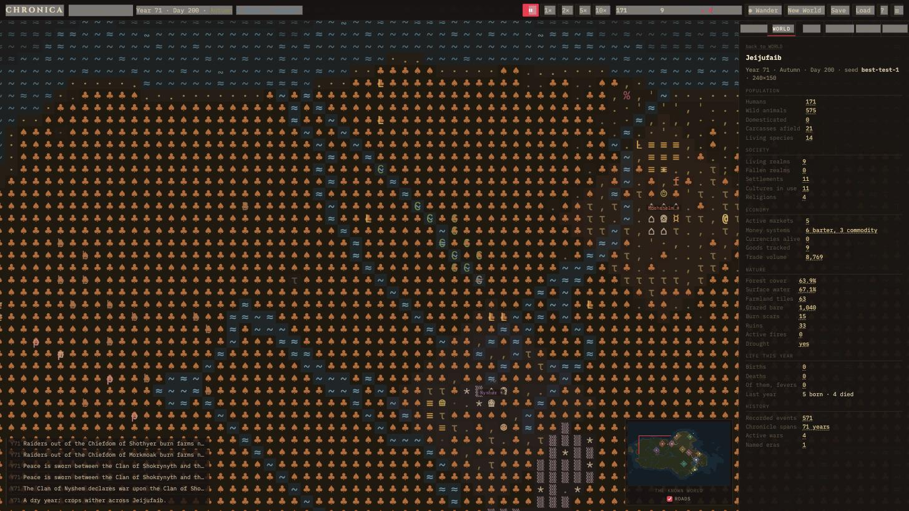

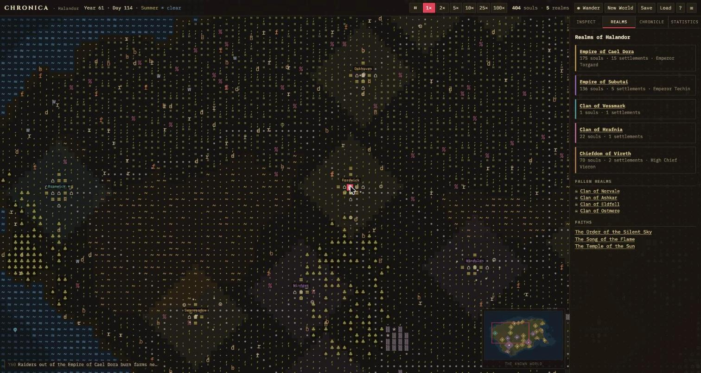

- **Inspect anything.** Click a tile, villager, animal, town, army, realm, or religion. Everything cross-links: a person links to their family, home, and realm, a realm links to its ruler, settlements, and rivals
- **Follow mode.** Select any creature and follow it. The camera tracks it and it glows crimson, the same highlight used in classic ASCII roguelike traditions
- **Wander mode.** Press E to embody a wanderer, a red @ you steer through the world on foot with the arrow keys
- **Time control.** Pause, or run at 1x, 2x, 5x, 10x, 25x, or 100x. A year is 360 simulated days
- **Statistics.** Population and per-realm charts sampled yearly, drawn from the live simulation history
- **Minimap.** The whole continent with faction territories tinted, settlements marked, armies as red dots, and a click-to-jump viewport
- **Save and load.** Snapshot the entire world to browser storage or export it as a portable string
- **New worlds.** Choose a seed, a world size, and how many years of history to simulate before you arrive. The world can open with 80 years of chronicle already written
- **Three simulations.** Normal is the classic engine with a full speed ladder. Pro adds plot-recruited rebellions, minds that break under loss, and prophets born of grief, with zero scheduled drama. Best is Pro with nothing thinned for speed, in the spirit of Dwarf Fortress: every villager physically walks at any population, memories run to sixteen per soul, bonds to sixteen, the chronicle holds twenty thousand events, and every remembered life stays in the save forever
- **Souls carry their past.** A person's panel shows their memory (famines lived through, homes conquered, friends cut down, and the distorted family tales inherited from their parents, each with the realm it blames) and their bonds (friends, comrades in arms, creditors, rivals, graded loose to unbreakable)

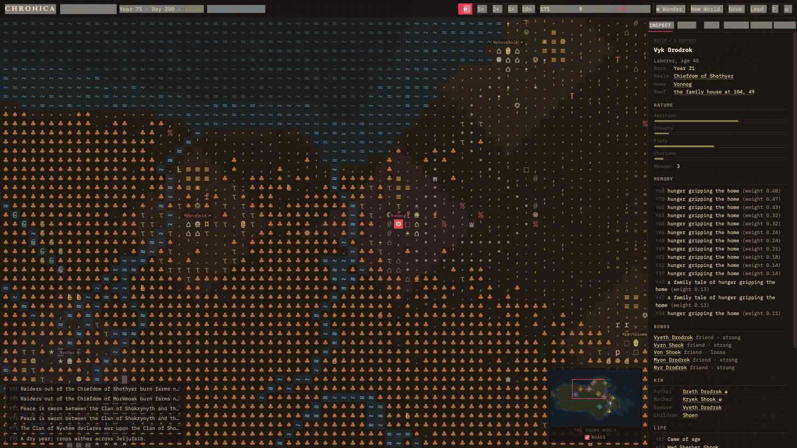

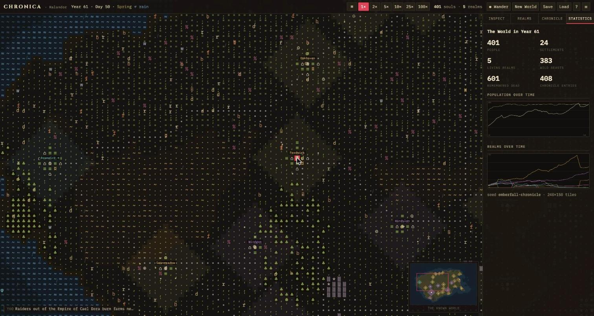

### Controls

| Input | Action |
|---|---|
| Drag / WASD / arrows | Pan the camera |
| Scroll / + and - | Zoom from street level to continent |
| Click | Inspect tile, person, beast, town, or army |
| F | Follow the selected creature |
| E | Embody a wanderer and walk the world |
| Space | Pause and resume |
| 1 to 7 | Simulation speed |
| T | Toggle settlement name labels |
| R | Toggle the road network overlay (also the checkbox by the minimap) |
| H | Open the chronicle |
| Tab | Toggle the side panel |
| ? | Help |

---

## Deep dive: how it works

The whole game is one HTML file with no external dependencies beyond two Google Fonts. It is around 6,000 lines organized in the layers below.

### 1. World generation
Elevation is fractal value noise (five octaves) minus a radial falloff whose center is itself distorted by noise, which produces one believable continent per seed instead of noise soup. Temperature falls with latitude and altitude, moisture is a second noise field, and a Whittaker-style lookup assigns biomes. Rivers are walkers dropped on wet highlands that always step to the lowest neighbor, merge when they touch an existing river, and flood a pit into a lake when trapped. A flood fill from the map edge separates true ocean from inland water.

### 2. Time and the tick
One tick is one simulated day. At 1x speed the simulation runs 5 days per second, at 100x it targets 500. Each tick runs weather, settlement economies, every living person, wildlife, armies, caravans, and migrant bands, with monthly, quarterly, and yearly passes layered on top for construction, job assignment, marriages, diplomacy, tech, and statistics sampling. The tick is budgeted inside each animation frame so the UI never freezes, and a background interval keeps the world alive even when the tab is hidden. A tick costs well under a millisecond at a population of 2,500.

### 3. The people loop
The expensive parts of agent simulation are pathfinding and decision making, so Chronica splits them. The economy is computed at settlement level from profession counts, which keeps it stable at any speed, while the villagers you watch walking to the woods and back are the visible layer of that same economy and grant small bonuses when they return. Short trips use a cheap greedy walker and the full A* with a binary heap is reserved for caravans, armies, and migrant bands crossing the continent, with a per-tick budget so a hundred simultaneous requests cannot stall a frame.

### 4. Politics as a graph
Diplomacy is a symmetric relations score per faction pair, drifted yearly by border distance, religion, leader personality, trade, and raid events. War is never rolled from a table: a ruler weighs what they have actually heard about a neighbor (news travels only with caravans, ships, and refugees, so their picture of the world is stale) against real shortages, real crowding, real grievances carried in the memories of their people, and their own ambition, and every declaration event stores those decision weights so you can open its card and read exactly why it happened. Succession is contested: on a ruler's death the claimants, children, siblings, generals, and powerful stewards, are scored on blood, wealth, troops, and the friendship webs of the living, and when two claims are close the realm splits into civil war. Distant settlements are run by stewards whose loyalty erodes with road distance, unpaid wages, and grievance, and a strong steward under a weak crown will simply declare independence. Since renown comes from battles, bear hunts, founding settlements, and prophecy, the mechanism that picks new rulers is fed by the rest of the simulation, and that is exactly how a farmer becomes a king.

### 5. The economy earns its money
There is no technology called currency. Every settlement keeps a physical inventory of nine goods (grain, meat, fish, wood, stone, ore, metal, tools, salt) produced by its actual residents, eaten, worn out, and spoiled daily, with local prices set by supply against demand. Caravans and trade ships launch only when a trader sees a real arbitrage profit between two towns they actually know about. Every barter exchange that fails for want of matching goods is counted, and when that measured friction grows heavy enough, the realm's markets converge on whichever good their own ledgers say is most traded, most durable, and most divisible: salt in one world, grain or fish or cattle in another. Coinage needs more: a living master of minting (itself discoverable only downstream of smelting, which needs ore in the ground and miners at work), a full treasury, and trade too heavy for sacks of the commodity. A king at war with an empty treasury may debase his coin; prices inflate, traders start refusing it, and the currency can collapse back to salt and barter. Every one of these stages is reversible and none of them is guaranteed. In test worlds one realm struck two named currencies and debased both to ruin, while its island neighbor never monetized at all in four centuries.

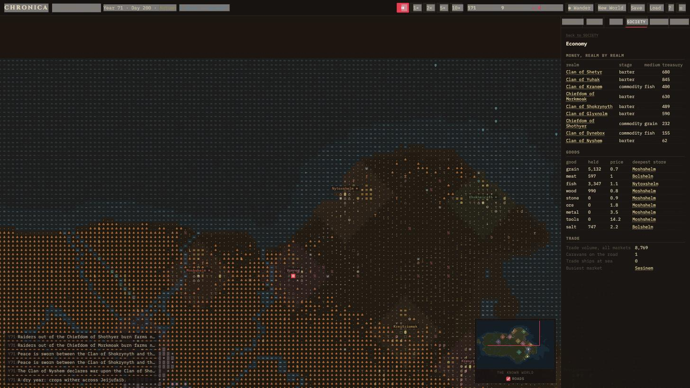

### 6. Knowledge lives in skulls
The tech tree is gone. Techniques (smelting, ironwork, irrigation, writing, minting, masonry, the wheel and the waterwheel, shipwrighting) exist only in the heads of named individuals. They are discovered by a specialist facing a real local problem in the right geography, passed master to apprentice over years, carried by migrants and captives, and lost when the last knower dies. Realms diverge because their mountains, rivers, and coasts differ, and the chronicle regularly records a craft dying with its last master and being rediscovered generations later.

### 7. Memory and the long grudge
People carry up to eight personal memories of what they witnessed: razings, famines, conquests, the violent deaths of friends. Memories fade, and children inherit their parents' strongest griefs in distorted, simplified form, which is how a razing becomes a generational hatred of the realm that ordered it. Rebellion, migration, and vengeance all read these memories instead of any global counter. Population has no hidden world cap: births are gated by local grain and local roofs, and dense towns breed fevers in proportion to their crowding, so cities become population sinks exactly as they were before sanitation, and different worlds settle at very different populations.

### 8. Rendering
The renderer is a canvas glyph engine in the visual language of classic ASCII simulations: a warm black ground, olive forests, dithered mauve mountains, wavy blue water, and one crimson accent reserved for the creature you are following. Every glyph and color pair is rasterized once into an atlas of small offscreen canvases and blitted with drawImage. The terrain layer is cached to an offscreen canvas and only repainted when the camera crosses a tile boundary, the zoom changes, the season turns, or the world itself changes, so the per-frame cost is mostly just entities. Below a zoom threshold the map switches to colored blocks and reads like a strategic map, with faction territories tinted over the terrain.

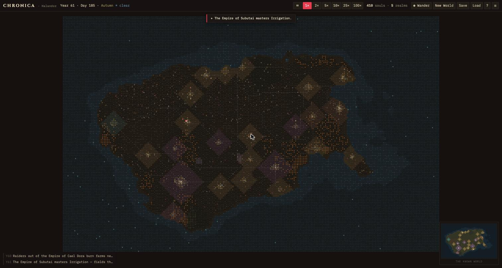

### The save format
Saving serializes the full world: typed arrays are base64 packed, the living population, the remembered dead, settlements, factions, religions, relations, the chronicle, and the statistics history are all included. A medium world after a century of history is around 2.5 MB and round-trips exactly.

---

## Walking the world

Press E and the sky observer becomes a red @ standing on the earth. You can walk the roads between towns, stand in a market while caravans arrive, or follow an army to a siege on foot.

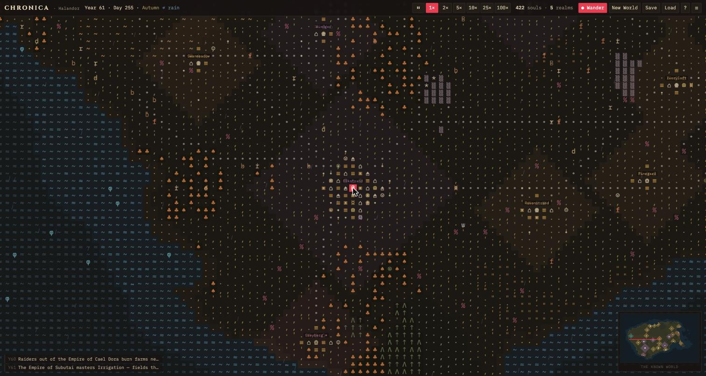

---

## Running it

- **Hosted:** [https://eeman1113.github.io/chronica/](https://eeman1113.github.io/chronica/)
- **Local:** clone the repo and open `index.html` in any modern browser. That is the entire installation process.

```bash
git clone https://github.com/Eeman1113/chronica.git
cd chronica
open index.html
```

Tips for your first world:
1. Let it open with the default 40 years of pre-written history
2. Click a town, then click its notable residents and read their lives
3. Set speed to 25x or 100x and go make coffee
4. Come back, open the Chronicle, filter by War or Politics, and piece together what happened
5. Find the current ruler of the largest empire and read how they got the throne

## Credits

Visual direction inspired by the ASCII world-map tradition of Dwarf Fortress and its tileset culture. Fonts are IBM Plex Mono and Cinzel via Google Fonts. Everything else, from the noise functions to the succession law, is hand-rolled vanilla JavaScript in a single file.
