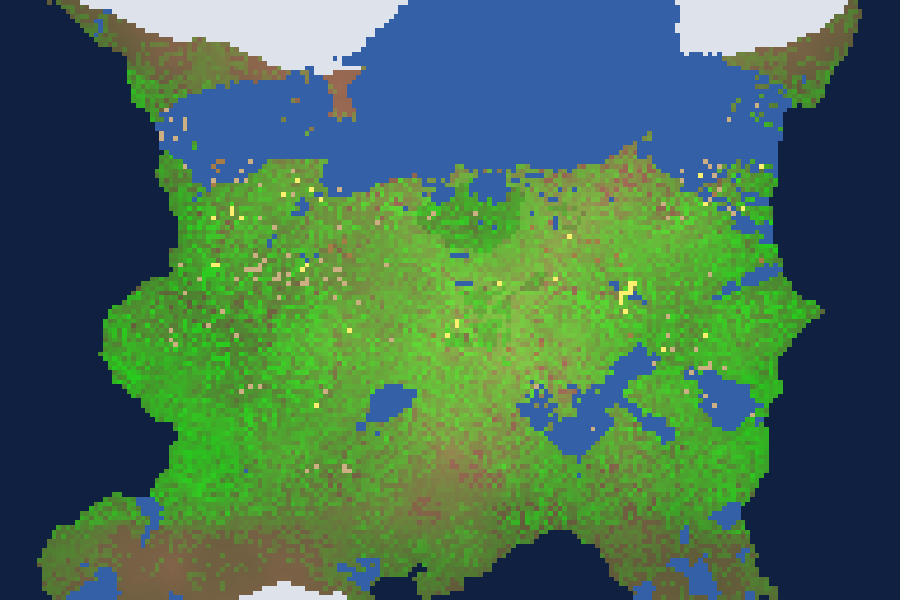
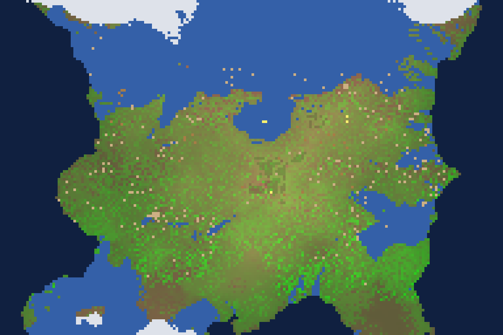
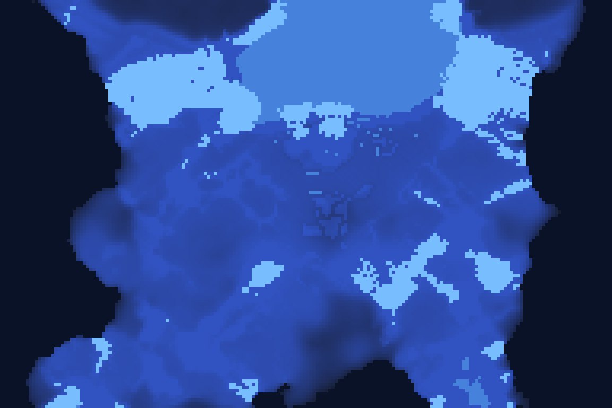
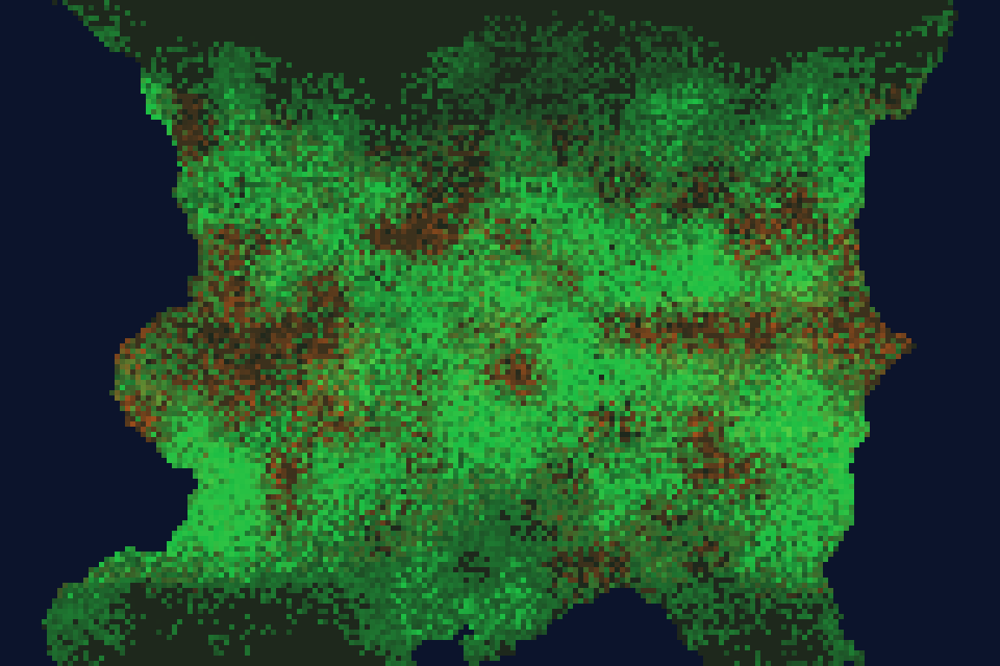
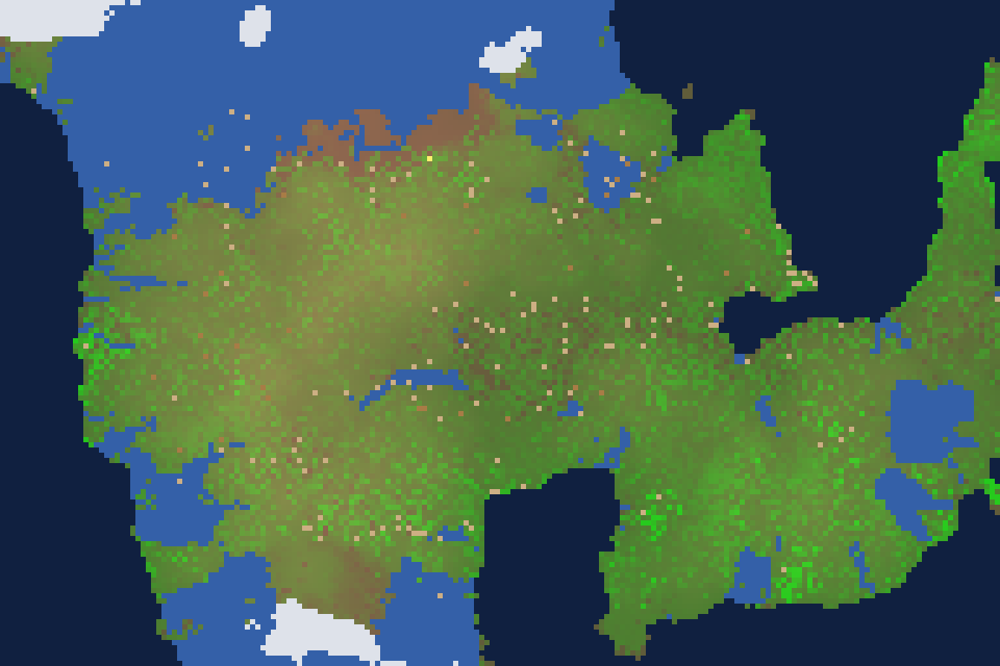
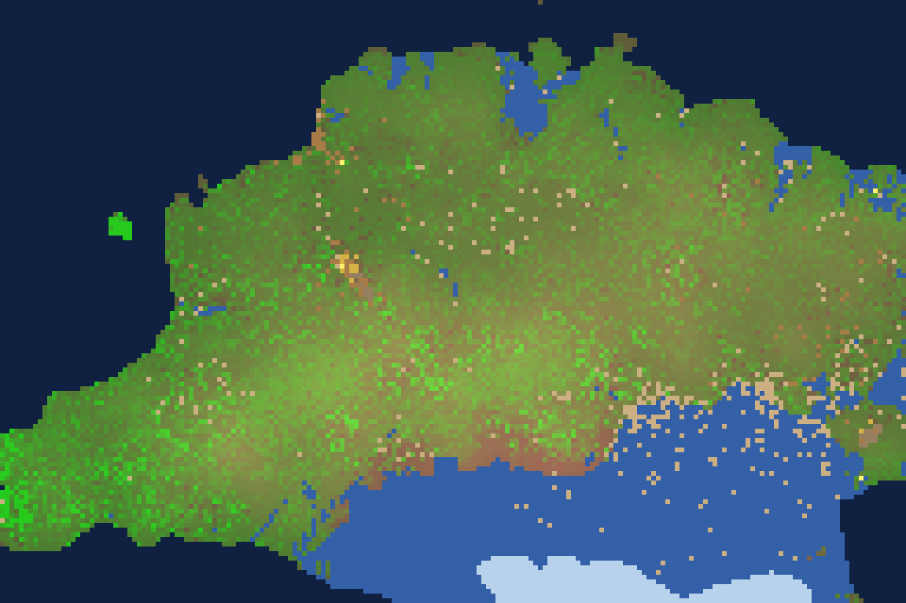

# Chronica — the Rust engine

> *Do not simulate the story. Simulate the world that could produce the story.*

This is the native rewrite of the [Chronica prototype](README.md) (`index.html`) as a
deterministic, fully emergent world engine in Rust. **Everything that exists is an individually
simulated entity** — every cell, every river's water, every blade of grass, every hare, every
person — and history is the causal, queryable consequence of their interactions. There is no
story director, no scheduled drama, no "important NPC" tier, and nothing is ever pruned.

Built in eight audited stages (reports: [`docs/STAGE_REPORTS.md`](docs/STAGE_REPORTS.md); design
docs: [`docs/`](docs/)). **15/15 tests green**, including byte-exact determinism across thread
counts and save/load.

---

## The world

*A founding summer (seed 2024, year 0). Green is real vegetation cover — tens of thousands of
individual plants; blue is water that actually flowed there; white is snowpack; yellow dots are
people; tan dots are herds.*



*The same world three years on. Nobody placed a single river or lake — rain fell on generated
terrain, flowed downhill, filled basins, spilled, and carved the drainage you see. Winters bury
the high latitudes; spring melt floods the valleys.*



### Hydrology lens

*Groundwater fill (dark → bright) with derived river channels (light blue) and lakes. Aquifers
drain downslope by hydraulic head; baseflow keeps valley streams alive between rains; plants
transpire from this same store — drink the valley dry and the forest feels it.*



### Vegetation lens

*Every pixel's brightness is the summed biomass of the individual plants actually rooted there —
trees (green) versus grasses and reeds (yellow-green). Forest cover is `derive(trees)`, never a
density field.*



*A six-year-old world (seed 7): fire scars, regrowth, migrating herds.*



### The human mark

*Seed 1 at year 4: golden wheat fields by the water, tan roads walked into existence by ten
thousand footsteps, huts and storehouses (brown) — every one of them founded, built, and worn by
a specific person on a specific day, queryable to the unit.*



---

## History is derived, not written

All player-facing text is generated from structured causal events. A person's biography is
literally a query over what happened to them:

```
$ world_inspector world.crn person 3
Sana — culture 0, dead
--- biography (derived from events) ---
  Year 0: Sana felled broadleaf oak
  Year 0: Sana raised a dwelling
  Year 0: Sana laid up 2.1 in store
  Year 1: Sana laid up 1.9 in store
  Year 2: Sana and Mirvertal became close
  Year 2: Sana first spoke of The Way of Tarama
  Year 2: Sana died of hunger
```

Sana's belief was born from her own grief memories (the origination event cites them); had she
lived, it would have spread only through real conversations. In this world another faith fared
better:

```
$ world_inspector world.crn beliefs
The Way of Belverbel: 6 faithful
```

And every "why?" walks the causal graph down to physical state:

```
$ world_inspector world.crn why 46550
Year 3: a hare died of hunger
  ← because Hunger was 2.00
```

---

## What is actually simulated

| Layer | The truth underneath |
|---|---|
| **Water & weather** | Rain fields → surface flow by hydraulic head → groundwater with downslope drainage → springs, evaporation, erosion. Rivers/lakes are *observations*, never placed. Ice grows on still winter water and bears weight (roads that exist only in the cold); wind carries fire downwind; floods expel waders and claim dwellings. |
| **Plants** | Each an entity with **heritable genes** (yield, hardiness): growth from its cell's real water/light/nutrients, transpiration back into the aquifer, light competition, seeding real neighbors, winter dormancy, death always with a cause. Farmers keep seed from the finest heads — **domestication emerges from that choice**, compounding over generations. |
| **Animals** | Each an individual: needs, condition, inherited genes, perception via spatial index only, one shared utility brain with **recorded rationale**, pursuit predation, courtship, gestation with recorded sire. **Trout live in the rivers** (following the falling water in dry season, sifting a real detritus column, boom-crashing like any population). Animals remember good ground and attack sites; starving bold predators stalk *people*, and witnesses carry the memory. Feeding a wild sheep day after day tames it; the herd is the winter larder. |
| **Sickness** | Pathogens live in bodies: sparking only in real crowds on real wet ground, crossing only on real contacts (a conversation, a shared roof, butchering a kill, tending a beast), running a course against each host's health, killing with the case as cause, leaving immunity behind. |
| **People — body** | Nutrition, exposure (winter without walls and a fed hearth kills), fatigue; food **rots** by real temperature and is saved by real smoke over real fires; carrying has limits; houses are raised over days of shared or private labor, weather into ruins, and shelter against beasts (a barred door more than doubles the defense). |
| **People — mind** | Uncapped decaying memories; a **working map of the land** (food, water, danger) learned by living and traded in conversation — secondhand knowledge ages and misleads; **seasonal hunger schemas** that drive gathering and smoking *before* the lean months return; the past **retold and distorted by the listener** (fear amplifies, warmth softens) so a killer beast becomes a clan's sworn enemy in heads that never saw it — and kin hunt that specific animal by identity. |
| **People — each other** | Typed relationships only from real encounters; marriage → conception only when spouses are together; grief through real kin bonds; **shared meals bind, stolen ones burn** (witnesses carry the thief's name into the grievances that feed raids); the mother-line is recognized and marriage looks outward, weaving bands together; techniques live in heads, taught along bonds, extinct with the last untaught knower. |
| **Villages** | One capacity — *put your day's work into any project you benefit from* — and hamlets raise **common storehouses** (founded from surplus where homes cluster) and **palisade rings** (founded segment by segment by whoever carries the memories of violence — fear is the architect). Footsteps wear vegetation into desire lines that become **roads**; grass reclaims the unwalked. Settlements are *recognized* from real clusters; beliefs originate in real memories and spread in real conversations. |
| **History** | Append-only causal event graph, never capped, never pruned; consequences a derived reverse index; all text generated on demand; every "why?" walks to physical or social state. |

## Guarantees (tested, not aspirational)

- `seed → world` is **byte-identical** across reruns, across 1 vs N threads, and across
  save→load→continue (`engine/tests/determinism.rs`).
- Emergence suite: **A** (forest stats = count of tree entities; felling reduces cover *because*
  trees were removed), **B** (rivers/lakes from rain alone), **C** (settlements from real
  clusters), **D** (conflict possible, never scheduled — verified peaceful seeds exist),
  **E** (knowledge spreads by teaching / dies with its last knower), **F** (why-chains reach
  physical state), plus predator/prey causality.
- Forbidden-pattern grep (`if year ==`, scheduled drama, event quotas): clean.

## Run it

**One line — clone, build, and open the world** (needs [Rust](https://rustup.rs) 1.88+):

```sh
git clone https://github.com/Eeman1113/chronica.git && cd chronica && cargo run --release -p chronica-renderer
```

First build takes a few minutes; then the window opens on a fresh world. Everything else:

```sh
export PATH="$HOME/.cargo/bin:$PATH"   # rustup toolchain (needs rustc 1.88+)

cargo run --release -p chronica-renderer            # live map, click-to-inspect, chronicle
cargo run --release -p sim_runner -- --seed 7 --days 3600 --stats-every 360 --save world.crn
cargo run --release -p world_inspector -- world.crn                 # chronicle voice
cargo run --release -p world_inspector -- world.crn why <event_id>  # causal chain
cargo run --release -p world_inspector -- world.crn person <idx>    # derived biography
cargo run --release -p replay -- verify world.crn                   # bit-identical replay
cargo run --release -p snapshot -- --seed 2024 --days 1230 --out shot  # headless map PNGs (PPM)
cargo test --release --workspace                                    # the full suite
```

**Performance** (Apple Silicon laptop): 275 sim-days/s at 192×128 with ~40k plants, hundreds of
animals, full hydrology and fire; complete world saves are ~10 MB; details in
[`docs/PERFORMANCE.md`](docs/PERFORMANCE.md).

## Ways to die in Chronica (all real, all logged)

Every one of these happened in a real run, was diagnosed *from the engine's own causal event
log*, and taught us something — Chronica's growing collection of Dwarf-Fortress-style emergent
obituaries:

- **The world that drowned standing up.** Early hydrology filled every shallow basin until half
  the continent was marsh; 246,495 plants died waterlogged in twenty years — while the death
  events insisted it was "drought," because the cause-attribution couldn't yet tell *too much
  water* from *too little*. The fix wasn't kinder plants; it was carving real drainage.
- **The forests that froze every single winter.** Temperate oaks kept seeding the north each
  summer (the germination check only asked about *today's* weather) and froze en masse each
  January — 1,078,225 frost deaths before trees learned dormancy and seeds learned to fear
  winter.
- **The grass that drank the rivers dry.** A 375,000-strong sward transpired six times the
  continent's rainfall. The rivers vanished, then the lakes, then every animal died of thirst
  under a bright green meadow.
- **Deer starving in a salad bar.** A movement bug made animals overshoot their target cell and
  oscillate two tiles forever — herds ground their own footprint to dust and starved while lush
  grass stood one step away, hunger rising *while the event log showed them eating daily*.
- **The generation that never grew up.** Every founding animal was seeded age zero; the wolves
  (seeded at six times a sane predator ratio) ate the entire world's children before a single
  one reached breeding age. Result: forty years, zero births, extinction by dinner.
- **Death by nostalgia for a river.** People remembered where water was — and never forgot. When
  seasonal rivers moved, they walked to the dry bed, stood on it, re-targeted it the next
  morning, and died of thirst on the memory of a spring.
- **Nineteen marriages, zero children.** Conception only existed inside the *courtship* action —
  which married couples, by definition, never take again. A whole society of devoted, childless
  marriages until spouses learned that being together counts.
- **Hut mania.** With shelter scored above supper, fifty settlers built fifty-three huts and
  starved by day 38 — everyone died with a roof, a full woodpile, and an empty stomach.
- **The sharing economy that ate the winter.** Making granaries a band commons (real forager
  ethics!) drained every store to zero before the snow came. Generosity, it turns out, needs a
  surplus first.
- **The spring hungry gap.** Deaths now cluster in early spring — stores gone, first growth not
  yet in — the same season that killed real pre-modern societies. The engine rediscovered
  documented history without being told.
- **Sana.** Felled two oaks, raised a dwelling, laid up food, befriended Mirvertal, founded a
  religion from her own grief — and died of hunger in Year 2. Her faith died with zero faithful;
  a rival's, *The Way of Belverbel*, got six. Her whole biography above is queried, not written.
- **The world where one fish was born.** The first trout release seeded fish "wherever the water
  was deep enough" — at a moment when, 240 simulated days into a young world's rain, almost
  nowhere was. Census: one trout. It starved alone in year one, the only fish that ever lived
  there. (The fix wasn't more fish; it was letting the world finish hydrating first.)
- **Stranded silver.** The second trout release died differently: dry-season rivers shrank and
  whole shoals died gasping in the shallows — until fish learned what real fish know: follow the
  falling water to the deep pools.
- **Frozen in sight of the frame.** Winter exposure landed with staged construction: people who
  didn't finish their walls before the frost died beside the half-raised □ of their own house —
  with a causal chain reading *temperature −14°, shelter: none*.
- **The murrain in the fold.** Taming brought herds to the camps; herds brought crowding; and the
  first zoonotic sickness crossed at the exact moment of care — feeding, tending, butchering.
  Domestication and epidemic arrived as a package, uninstructed, exactly as they did for us.
- **The clan's sworn enemy.** A bear killed a woman; her kin took up vengeance against that bear,
  by identity — and the retelling spread the enmity to people who had never seen it, their fear
  inflating its weight with each telling. The first legend was a grudge.

None of these were scripted, none were patched by cheating — every fix was physical (drainage,
dormancy, transpiration budgets, predator ratios, memory invalidation, provisioning). That's the
point of the project: **the world is allowed to kill you, but it must always be able to tell you
exactly why.**

## Honest state of the world

The engine is complete through all eight stages plus the survival-physics, biology, cognition,
moral-economy, and village layers (see [`docs/ROADMAP.md`](docs/ROADMAP.md) for the full plan and
[`docs/STAGE_REPORTS.md`](docs/STAGE_REPORTS.md) for the build history). Open, honestly:

1. **Lineage persistence is still seed-variable.** Some worlds now carry villages, herds, fields,
   and second-generation families for decades; others fade within one. Survival sits on a real
   knife-edge (as it did for actual foraging bands), and every collapse is diagnosable from the
   event log. The demographic margin keeps widening with each capacity — hearths, smoking racks,
   fish, shared granaries, learned foresight — never with a spawn or a stat.
2. **Markets, currencies, factions, and armies-at-scale** aren't built yet: goods are honest
   stores with real provenance pressure, and conflict is band-scale feuding. The capacities they
   will emerge from (barter, deference, group raids) are next on the roadmap.

## Repository map

```
engine/            the simulation (core, world, terrain, climate, water, vegetation, fire,
                   species, brains, animals, humans, objects, society, history, inspection,
                   persistence, sim)
renderer/          egui app — reads the inspection API, owns no state
tools/             sim_runner · world_inspector · replay · snapshot
engine/tests/      determinism + emergence suite (Tests A–F, predator/prey)
docs/              AUDIT (the prototype, every cheat mapped) · ARCHITECTURE · SIMULATION_MODEL ·
                   ENTITY_MODEL · EVENT_MODEL · DETERMINISM · SAVE_FORMAT · PERFORMANCE ·
                   DECISIONS · STAGE_REPORTS
index.html         the original browser prototype (behavioral reference, unchanged)
```
